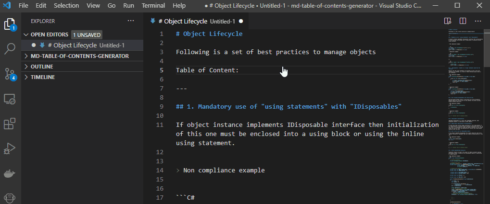

# MD Table of contents Generator

Simple Markdown Table of contents generator.

## Features

This extensions generates a table of contents of any MD file locating the heading tags of the text.

## Usage

Run and select **Generate table of contents**

## Requirements

"vscode": "^1.55.0"

## Known Issues

Nothing new here so far!

## Release Notes

### 1.0.0

Initial release

**Enjoy!**
